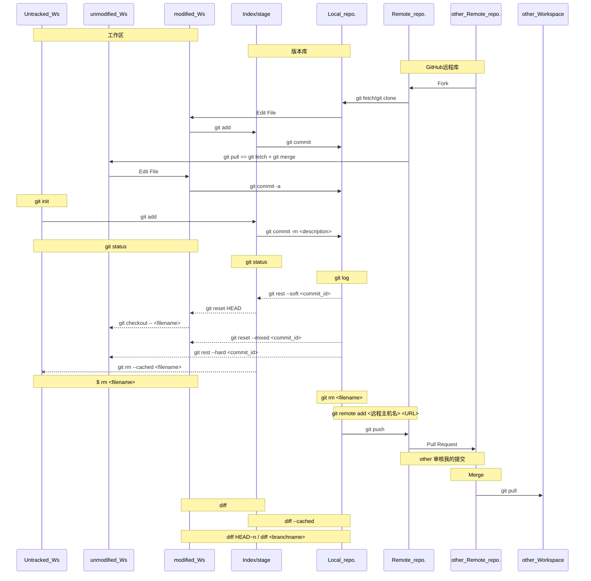
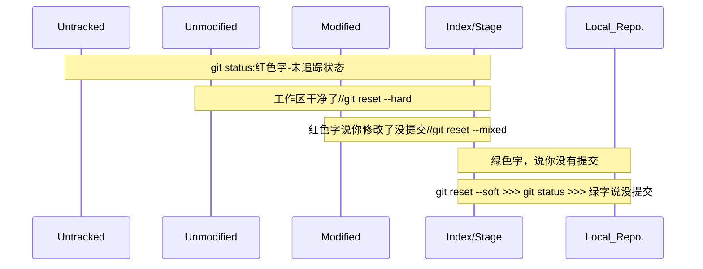

[TOC]


#0. 想说的话

##  0.1 鸣谢：

1. [廖雪峰老师](https://www.liaoxuefeng.com/wiki/896043488029600)

    课程主体框架来源。

2. [尚硅谷](http://www.atguigu.com/)

    课程参考视频。

3. [路飞学城-武沛齐-看故事学git](https://www.luffycity.com/courses/144/details-introduce)

4. [实验楼](https://www.shiyanlou.com/courses/4)

    部分细节参考。

5. [知乎](http://www.zhihu.com)

6. [bilibili](https://www.bilibili.com/)

7. [oh shit,git](https://ohshitgit.com/en)

8. [B站-魔王不造反](https://space.bilibili.com/33165125/?share_source=copy_link&share_medium=ipad&bbid=Z34CE6348510411F47BF9F4176C5DF08409F&ts=1574357420)

9. [Git应用开发详解-风中叶（张龙）](www.langsin.com)

## 0.2 这个稿子的始末


# 1. 说说Git

>Git是目前世界上最先进的分布式版本控制系统（没有之一）
>
>[廖雪峰](https://www.liaoxuefeng.com/wiki/896043488029600/902335212905824)

## 1.0 从版本控制说起

### （1）啥是版本控制？

>如果你用Microsoft Word写过长篇大论，那你一定有这样的经历：

### （2）为啥要用版本控制？

想删除一个段落，又怕将来想恢复找不回来怎么办？有办法，先把当前文件“另存为……”一个新的Word文件，再接着改，改到一定程度，再“另存为……”一个新文件，这样一直改下去，最后你的Word文档变成了这样：


过了一周，你想找回被删除的文字，但是已经记不清删除前保存在哪个文件里了，只好一个一个文件去找，真麻烦。

看着一堆乱七八糟的文件，想保留最新的一个，然后把其他的删掉，又怕哪天会用上，还不敢删，真郁闷。

更要命的是，有些部分需要你的财务同事帮助填写，于是你把文件Copy到U盘里给她（也可能通过Email发送一份给她），然后，你继续修改Word文件。一天后，同事再把Word文件传给你，此时，你必须想想，发给她之后到你收到她的文件期间，你作了哪些改动，得把你的改动和她的部分合并，真困难。

于是你想，如果有一个软件，不但能自动帮我记录每次文件的改动，还可以让同事协作编辑，这样就不用自己管理一堆类似的文件了，也不需要把文件传来传去。如果想查看某次改动，只需要在软件里瞄一眼就可以，岂不是很方便？

这个软件用起来就应该像这个样子，能记录每次文件的改动：

| 版本 | 文件名      | 用户 | 说明                   | 日期       |
| :--- | :---------- | :--- | :--------------------- | :--------- |
| 1    | service.doc | 张三 | 删除了软件服务条款5    | 7/12 10:38 |
| 2    | service.doc | 张三 | 增加了License人数限制  | 7/12 18:09 |
| 3    | service.doc | 李四 | 财务部门调整了合同金额 | 7/13 9:51  |
| 4    | service.doc | 张三 | 延长了免费升级周期     | 7/14 15:17 |

这样，你就结束了手动管理多个“版本”的史前时代，进入到版本控制的20世纪。

### （3）版本控制工具应该具备的功能：

1. 协同修改；
    + 多人并行不悖的修改服务器端的同一个文件。
2. 数据备份：
    + 保存目录和文件的当前状态；
    + 保存每一个提交过的历史状态。
3. 版本管理：
    + 保存每一个版本的文件信息的时候要做到不保存重复数据，节约存储空间；
    + SVN：增量式管理
    + Git：文件系统快照
4. 权限控制：
    + 对团队中参与开发的人员进行权限控制。
    + 对团队外开发者贡献的代码进行审核（Git独有）
5. 历史记录：
    + 查看修改人、修改时间、修改内容、日志信息。
    + 将本地文件恢复到某一个历史状态。
6. 分支管理：
    + 允许开发团队在工作过程中多条生产线同时推进任务，进一步提高效率。

### （4）集中式版本控制系统：

1. CVS（开源）（最早）
2. SVN（开源）（目前用的最多）
3. ClearCase（IBM）（收费）（垃圾）
4. VSS（MicroSoft）（垃圾）

### （5）分布式版本控制系统：

1. BitKeeper
2. Git
3. Mercurial
4. Bazaar
5. Darcs

### （6）分布式PK集中式

Linus一直痛恨的CVS及SVN都是集中式的版本控制系统，而Git是分布式版本控制系统，集中式和分布式版本控制系统有什么区别呢？

先说集中式版本控制系统，版本库是集中存放在中央服务器的，而干活的时候，用的都是自己的电脑，所以要先从中央服务器取得最新的版本，然后开始干活，干完活了，再把自己的活推送给中央服务器。中央服务器就好比是一个图书馆，你要改一本书，必须先从图书馆借出来，然后回到家自己改，改完了，再放回图书馆。


集中式版本控制系统最大的毛病就是必须联网才能工作，如果在局域网内还好，带宽够大，速度够快，可如果在互联网上，遇到网速慢的话，可能提交一个10M的文件就需要5分钟，这还不得把人给憋死啊。

那分布式版本控制系统与集中式版本控制系统有何不同呢？首先，分布式版本控制系统根本没有“中央服务器”，每个人的电脑上都是一个完整的版本库，这样，你工作的时候，就不需要联网了，因为版本库就在你自己的电脑上。既然每个人电脑上都有一个完整的版本库，那多个人如何协作呢？比方说你在自己电脑上改了文件A，你的同事也在他的电脑上改了文件A，这时，你们俩之间只需把各自的修改推送给对方，就可以互相看到对方的修改了。

和集中式版本控制系统相比，分布式版本控制系统的安全性要高很多，因为每个人电脑里都有完整的版本库，某一个人的电脑坏掉了不要紧，随便从其他人那里复制一个就可以了。而集中式版本控制系统的中央服务器要是出了问题，所有人都没法干活了。

在实际使用分布式版本控制系统的时候，其实很少在两人之间的电脑上推送版本库的修改，因为可能你们俩不在一个局域网内，两台电脑互相访问不了，也可能今天你的同事病了，他的电脑压根没有开机。因此，分布式版本控制系统通常也有一台充当“中央服务器”的电脑，但这个服务器的作用仅仅是用来方便“交换”大家的修改，没有它大家也一样干活，只是交换修改不方便而已。


当然，Git的优势不单是不必联网这么简单，后面我们还会看到Git极其强大的分支管理，把SVN等远远抛在了后面。

CVS作为最早的开源而且免费的集中式版本控制系统，直到现在还有不少人在用。由于CVS自身设计的问题，会造成提交文件不完整，版本库莫名其妙损坏的情况。同样是开源而且免费的SVN修正了CVS的一些稳定性问题，是目前用得最多的集中式版本库控制系统。

除了免费的外，还有收费的集中式版本控制系统，比如IBM的ClearCase（以前是Rational公司的，被IBM收购了），特点是安装比Windows还大，运行比蜗牛还慢，能用ClearCase的一般是世界500强，他们有个共同的特点是财大气粗，或者人傻钱多。

微软自己也有一个集中式版本控制系统叫VSS，集成在Visual Studio中。由于其反人类的设计，连微软自己都不好意思用了。

分布式版本控制系统除了Git以及促使Git诞生的BitKeeper外，还有类似Git的Mercurial和Bazaar等。这些分布式版本控制系统各有特点，但最快、最简单也最流行的依然是Git！


## 1.1 Git的发展史

还得从Linux开始讲起：

+ 2002年前：Linus手动合并代码
+ CVS、SVN，Linus觉得不行
+ 2002年：BitKeeper（BitMover），出于人道，授权Linux社区免费使用，但不能破解。
+ 2005年：开发Samba的Andrew试图破解BitKeeper协议，被BitMover公司发行，要收回Linux社区的免费使用权。
+ 2005年：Linus用**C语言**写了一个分布式版本控制系统；主体开发用两周；一个月后Linux系统代码由Git管理。
+ 2008年：GitHub上线

## 1.2 Git & GitHub & Gitlab都是啥关系

+ Git是一个版本控制软件，或者说版本控制系统。
+ GitHub与GitLab都是管理版本的服务端软件，或者说远程仓库。
+ GitHub提供免费（代码公开）和收费（代码私有）服务。
+ Gitlab用于企业内部管理Git版本库，需要自己在服务器上搭建。

## 1.3 优势

1. 本地建立版本库，完整性能有 保证；
2. 本地版本控制，大部分操作在本地完成，不需要联网；
3. 多主机异地协同工作；
4. 重写提交说明；
5. 各个操作机会都有后悔药；
6. 更好用的提交列表；
7. 更好的差异比较；
8. 更完善的分支系统，分支操作非常快捷流畅；
9. 速度极快；
10. 尽可能添加数据而不是删除或修改数据；
11. 与Linux命令全面兼容


## 1.4 Git工作流程

### （1）两个端：

+ 本地
+ 云

### （2）四个区域：

+ 工作区（working directory）

    > 【就是你在电脑里能看到的目录】

    

+ 暂存区（stage/index）

+ 本地版本库（local Repository / History）

    > 【工作区有一个隐藏目录`.git`，这个不算工作区，而是Git的版本库。】

    

    > Git的版本库里存了很多东西：
    >
    > 1. 其中最重要的就是称为stage（或者叫index）的暂存区，
    >
    > 2. 还有Git为我们自动创建的第一个分支`master`，
    >
    > 3. 以及指向`master`的一个指针叫`HEAD`。

    

+ 远程版本库（Remote Repository）


### （3）五种状态：

+ untracked：
+ unmodified：
+ modified：
+ staged：
+ committed：




# 2. 安装并配置Git

## 2.1 Linux

1. 试着输入git：

   ```shell
   $ git
   The program 'git' is currently not installed. You can install it by typing:
   sudo apt-get install git
   ```

2. Debian或Ubuntu Linux：

   `sudo apt-get install git`

3. 老一点的Debian或Ubuntu Linux：

   `sudo apt-get install git-core`

4. 其他版本Linux：
直接通过源码安装。先从Git官网下载源码，然后解压，依次输入：
`./config`，`make`，`sudo make install`

## 2.2 MacOSX

1. homebrew

2. Xcode:

   运行Xcode，选择菜单“Xcode”->“Preferences”，在弹出窗口中找到“Downloads”，选择“Command Line Tools”，点“Install”

## 2.3 Windows

1. Git官网[下载安装程序](https://git-scm.com/downloads)，（[国内镜像](https://pan.baidu.com/s/1kU5OCOB#list/path=%2Fpub%2Fgit)）。
2. 按默认选项安装。
    + 选择安装工作目录；
    + 选择组件：
        + Git Bash Here命令行模式
        + Git GUI Here图文界面
    + 选择使用命令行环境：Use Git from Git Bash only
3. 安装完成后，在开始菜单里找到“Git”->“Git Bash”（或者在桌面空白处鼠标右击，出现Git Bash Here选项和Git GUI Here选项），点击这些，之后蹦出一个类似命令行窗口的东西，就说明Git安装成功！


## 2.4 配置Git仓库

### （1）设置签名：（用户名、Email）

【我们这里设置的签名和托管中心Github上的用户名email一点关系都没有】

>因为Git是分布式版本控制系统，所以，每个机器都必须自报家门：你的名字和Email地址。你也许会担心，如果有人故意冒充别人怎么办？这个不必担心，首先我们相信大家都是善良无知的群众，其次，真的有冒充的也是有办法可查的。


对于user.name和user.email来说，有3个地方可以设置：

1. `.git/config` ： `git config --local`

    特定项目级别：仅在当前本地库范围内有效

    ```shell
    # 不带参数
    $ git config user.name "wandx"
    $ git config user.email "xxx@qq.com"
    # cd到当前目录
    $ cd workspaces
    $ cat .git/config
    ```

    

2. `~/.gitconfig`（很常用）：`git config --global`

    用户级别：

    ```shell
    # --global参数
    $ git config --global user.name "zhaoyiyi"
    $ git config --global user.email "798998599@qq.com"
    # cd到系统用户目录
    $ cd ~
    $ ls -a
    $ vim .gitconfig
    ```


3. `/etc/gitconfig`（几乎不会使用）：`git config --system`

    系统级别：


+ 优先级：就近原则。

    项目级别 > 用户级别 > 系统级别


### （2）`git config`

1. `git config --list`列出所有配置信息
2. `git config --unset`删除某项配置信息
3. 


### （3）配置命令别名

+ 命令行配置：

    ```shell
    $ git config --global alias.st status
    
    $ git config --global alias.co checkout
    $ git config --global alias.ci commit
    $ git config --global alias.br branch
    
    # git reset HEAD <filename> 把暂存区的修改撤销掉
    $ git config --global alias.unstage 'reset HEAD'
    
    # 显示最后一次提交信息
    # log牛逼显示
    $ git config --global alias.last 'log -1'
    $ git config --global alias.lg "log --color --graph --pretty=format:'%Cred%h%Creset -%C(yellow)%d%Creset %s %Cgreen(%cr) %C(bold blue)<%an>%Creset' --abbrev-commit"
    ```

+ 配置文件：

    `vim .git/config`

    别名就在`[alias]`后面，要删除别名，直接把对应的行删掉即可。

    而当前用户的Git配置文件放在用户主目录下的一个隐藏文件`.gitconfig`中。

# 3. Git基本操作

## 3.1 创建Git本地版本库

### （0）版本控制 --> Git软件去管理文件夹

+ 版本库：

> 版本库又名仓库，英文名**repository**，你可以简单理解成一个目录，这个目录里面的所有文件都可以被Git管理起来，每个文件的修改、删除，Git都能跟踪，以便任何时刻都可以追踪历史，或者在将来某个时刻可以“还原”。

+ 管理流程：
    1. 进入要管理的文件夹；
    2. Git初始化该文件夹，即Git开始管理它了；
    3. 管理，查看状态，添加，提交；
    4. 生成版本库。

### （1）`git init`初始化创建本地仓库

1. 创建一个空目录

   ```shell
   $ mkdir learngit
   $ cd learngit
   $ pwd
   /Users/apple/learngit
   ```

2. 通过`git init`命令把这个目录变成Git可以管理的仓库

   ```shell
   $ git init
   Initialized empty Git repository in /Users/apple/learngit/.git/
   ```

+ :warning:：不要乱动.git目录！
+ `ls -ah`可以查看隐藏目录
+ 可以在已经有东西的目录创建仓库

### （2）`git clone`从远程端github等克隆

1. `git clone`相当于三个命令：

    + 完整的把远程库下载到本地，`git fetch`；
    + 创建origin远程库别名；
    + `git init`将当前文件夹初始化成本地库；

2. 知道项目仓库地址（Git URL）

    获取方法：

    + 

    支持的协议：

    + ssh://
    + http(s)://
    + git://

3. `git clone`从远程仓库中克隆

    ```shell
    cd /home/shiyanlou/
    git clone https://github.com/shiyanlou/gitproject
    ```

4. 查看克隆过来的这个仓库

    ```shell
    cd /home/shiyanlou/
    ls -ahl
    cd gitproject
    ls -a
    ```

### （3）从本地其他区域克隆


## 3.2 `git status`查看版本库各文件状态

### （0）原理

> `git status`本质上是作用于Index的一个命令。
>
> 本质上是在同时比较四种状态和三个工作区。
>
> 【查看工作区、暂存区状态】



### （1）五大状态：

1. Untracked：

    + 红色字；
    + nothing added to commit but untracked files present；
    + 需要用`git add`改变状态至Staged；

2. Unmodified：

3. Modified：

    + 红色字；
    + Changes not staged for commit；
    + `git add` or `git commit -a`改变状态至Staged；
    + `git checkout -- <filename>` 丢次本次修改，还原到之前Unmodified状态；

4. Staged：

    + 绿色字；
    + Change to be committed；
    + `git commit`改变状态至committed；
    + `git reset HEAD <filename>` 返回到unstaged未添加状态，即modified状态；

5. Committed（clean）：

    + 白色字；

    + nothing to commit, working derectory clean；
    + `git reset --soft <filename>`至taged状态；
    + `git reset --mixed <filename>`至Modified状态；
    + `git reset --hard <filename>`至Unmodified状态；


### （2）关联远程库后状态变化

+ `git status`此时GIt会比较你当前最新提交和远程库的origin/master分支之间相差几个版本。

### （3）工作区状态随时查看

1. 要随时掌握工作区的状态，使用`git status`命令

    ```shell
    On branch master
    Changes not staged for commit:
      (use "git add <file>..." to update what will be committed)
      (use "git checkout -- <file>..." to discard changes in working directory)
    
    	modified:   readme.txt
    
    no changes added to commit (use "git add" and/or "git commit -a")
    ```

    

2. 如果`git status`告诉你有文件被修改过，用`git diff`可以查看修改内容

    ```shell
    diff --git a/readme.txt b/readme.txt
    index 03b0f6b..2ec3293 100644
    --- a/readme.txt
    +++ b/readme.txt
    @@ -1,4 +1,3 @@
    -Git is a version control system
    -this is my firt meet it.
    -most people say it is the best app in the world.
    -it's father is Linus, and it's free.
    +Git is a distribution version control system
    +that is my firt meet it.
    +it's father is Linus, it's free.
    ```

    

3. `gti commit -m <description>`提交

    ```shell
    learngit % git commit -m "1.add distribution;2.delete #4;3.changethis to that"
    On branch master
    Changes not staged for commit:
    	modified:   readme.txt
    
    no changes added to commit
    ```

4. 再用`git status`查看

    ```shell
    apple@my2bin-2 learngit % git status
    On branch master
    nothing to commit, working tree clean
    ```


## 3.3 `git add <filename>`

【添加文件到暂存区】

```shell
$ git add test.txt
$ git status
```


### （0）三个含义：

1. 将未追踪的文件添加进Index区并保持追踪状态，且为Staged状态；
2. 将已经被追踪，处于修改状态的文件纳入到Index区中，变成Staged状态；
3. 标识文件“冲突被解决”

### （1）`git commit -a`

【等同于git add】


### （2）`git add .`

【将所有文件都添加进暂存区】

+ 不同于`git add *`，这个尽量别用。
+ `git add .`会把当前文件夹都添加到Index区，但是被忽略的文件不添加；
+ `git add *` 则是全部添加，包括被忽略的文件。


## 3.4 `git commit -m <description>`

【提交文件从暂存区到Git版本库】

```shell
$ git commit -m "wrote a readme file"
[master (root-commit) eaadf4e] wrote a readme file
 1 file changed, 2 insertions(+)
 create mode 100644 readme.txt
 $ git status
```

### （1）`<description>`提交描述的作用


### （2）`git commit -a -m <description>`

【从工作区直接到版本库（未追踪的文件不可以）】


### （3）`git commit --amend`


+ `gti commit --amend -m <新修改的提交信息>`【改变上次提交的描述信息】
+ 修改命令虽然版本不会更迭，但是会改变版本的commit_id号；


### （4）commit_id与哈希值

+ （i）commit id 版本号：

> 需要友情提示的是，你看到的一大串类似`1094adb...`的是`commit id`（版本号），和SVN不一样，Git的`commit id`不是1，2，3……递增的数字，而是一个SHA1计算出来的一个非常大的数字，用十六进制表示，而且你看到的`commit id`和我的肯定不一样，以你自己的为准。为什么`commit id`需要用这么一大串数字表示呢？因为Git是分布式的版本控制系统，后面我们还要研究多人在同一个版本库里工作，如果大家都用1，2，3……作为版本号，那肯定就冲突了

+ （ii）哈希：

    + 哈希的特点：

        >1. 不管输入数据量有多大，输入同一个哈希算法，得到的结果长度固定；
        >2. 哈希算法确定，输入数据确定，输出数据能够保证不变；
        >3. 哈希算法确定，输入数据有变化，输出数据一定有变化，而且通常变化很大；
        >4. 哈希算法不可逆；

    + Git与哈希：

        > 1. Git底层采用的是SHA-1算法；
        > 2. 哈希算法被用来验证文件，原理是：
        > 3. Git就是靠这种机制来从根本上保证数据完整性的

+ （iii）指针

    

## -----------------------------------------------

## 3.5 删除文件

### （1）`rm <filename>`仅删除工作区

1. 仅删除工作区的，暂存区和版本库都还保留；

2. 执行`git status`后Git会告诉你哪些文件被删除；

3. 此时如果后悔删除，想回到未删除状态（即unmodified状态）：

    + `git checkout -- <filename>`

4. 删除后若要将本次删除操作同步至版本库，还需要添加和提交两步操作。

    ```shell 
    $ rm test.txt
    $ git add test.txt
    $ git commit -m 'just delete test.txt in WorkingSpace' test.txt
    ```

5. 提交后，若想回到未删除的版本，就用：

    + `git reset --hard HEAD^`

    

### （2）`git rm --cached <filename>`删除暂存区


### （3）`git rm <filename>` 删除工作区、Index、版本库

>`git rm <filename>` == `rm <filename>` + `git add <filename>`
>
>基于此，从版本库中删除有两种方法：

+ 方法一：

    ```shell
    $ git rm test2.txt
    $ git status
    Changes to be committed:
    	deleted: test2.txt(绿色)
    $ ls
    # 当前目录下已经没有test2.txt这个文件了
    $ git commit -m "delete test2.txt"
    ```
    
    
    
+ 方法一如果执行完`git rm`后悔，想返回未删除状态：

    `git reset HEAD <filename>`

    `git checkout -- <filename>`

    

+ 方法二：

    ```shell
    $ rm test2.txt
    $ git status
    Changes not staged for commit:
    	deleted: test2.txt(红色)
    $ ls
    $ git add test2.txt
    $ git status
    Changes to be committed:
    	deleted: test2.txt(绿色)
    $ git commit -m "delete test2.txt"
    ```

    

> 使用 `git rm` 命令删除后，
>
> Git会自动将已删除文件的信息添加到缓存区，
>
> `git commit` 提交后就会将本地仓库中的对应文件删除；
>
> 
>
> 而使用`rm`命令删除文件，
>
> 仅仅是在工作区把文件删除，想删除版本库，还需要：
>
> `git add `和`git commit -m`两步操作。


## 3.6 `git mv <原名字> <新名字>`重命名或移动文件

### （1）逻辑同`git rm`

### （2）重命名撤销

+ Linux重命名，本质是先新建一个文件，然后删除原文件。
+ 

## ----------------------------------------------------

## 3.7 `git log`查看提交日志（只显示当前指针之后的版本）

+ 【显示从最近到最远的提交日志】

```shell
apple@my2bin-2 learngit % git log
commit 71f86f488aabe4552b2438feb1edbe4451655c7a (HEAD -> master)
Author: 赵一一 <apple@my2bin-2.lan>
Date:   Tue Nov 12 21:53:49 2019 +0800

    append GPL

commit 5477a915918769a0051322fc843645d61478a1c9
Author: 赵一一 <apple@my2bin-2.lan>
Date:   Tue Nov 12 21:17:37 2019 +0800

    wrote a readme file
```


### （1）`git log --pretty=oneline`

【log日志放在一行显示】

```shell
apple@my2bin-2 learngit % git log --pretty=oneline
71f86f488aabe4552b2438feb1edbe4451655c7a (HEAD -> master) append GPL
5477a915918769a0051322fc843645d61478a1c9 wrote a readme file
```

### （2）`git log --abbrev-commit`

【哈希值只显示前七位】

### （3）`git log --graph`

【用图形方式展示各版本的关系】

【可以看到分支合并图】

### （4）`git log --stat`

> 显示在每个提交（commit）中哪些文件被修改了，
>
> 这些文件分别添加或删除了多少行内容，
>
> 这个命令相当于打印详细的提交记录


### （5）其他格式

> 你也可用 `medium`，`full`，`fuller`，`email` 或 `raw`。 如果这些格式不完全符合你的需求， 你也可以用 `--pretty=format` 参数定义格式。


### （6）`git log --pretty=format:'%h : %s' --topo-order --graph`

> 指定 `--topo-order` 参数，让提交按拓扑顺序来显示（就是子提交在它们的父提交前显示）


### （7）`git log --reverse`

【逆向显示排序，即顺时间顺序】

【默认情况，提交会按逆时间顺序显示】


### （8）`git log -n`

【仅显示最近n条提交信息】


### （9）`git log -p`

【展开显示每次提交的内容差异】


## 3.8 `git reflog`查看操作日志

【记录你的每一次命令】

【如果你回退某一个版本之后，又想回到未来的版本】

```shell
apple@my2bin-2 learngit % git reflog
71f86f4 (HEAD -> master) HEAD@{0}: reset: moving to 71f86
5477a91 HEAD@{1}: reset: moving to HEAD^
71f86f4 (HEAD -> master) HEAD@{2}: commit: append GPL
5477a91 HEAD@{3}: commit (initial): wrote a readme file
```


## 3.9 `git blame <filename>`查看每次提交作者

>Show what revision and author last modified each line of a file.

```shell
$ git blame test1.txt
9510afbb (ZhaoYiYi 2019-11-22 19:29:48 +0800 1) this is test1.txt
24cc7e58 (ZhaoYiYi 2019-11-22 19:38:41 +0800 2) v3:add 222 in branch master
24cc7e58 (ZhaoYiYi 2019-11-22 19:38:41 +0800 3) v2:add 2222 in branch dev
2aadabf1 (ZhaoYiYi 2019-11-22 21:54:14 +0800 4) zhaobin love wxx.
40acfe36 (ZhaoYiYi 2019-11-22 21:55:57 +0800 5) 55555
```


## -----------------------------------------------

## 3.10 `git diff`比较文件差异

【每次修改，如果不用`git add`到暂存区，该修改就不会加入到`commit`中】

### （0）`diff <file1> <file2>`

+ Linux系统中比较两个文件的差异
+ `diff -u <file1> <file2>` 

### （1）`git diff <filename>`

+ 将工作区中的文件和Index区进行比较；
+ 不带文件名的时候是比较全部文件；

### （2）`git diff HEAD~n <filename>`

+ 将工作区中的文件和本地对应的某一个版本库记录进行比较；
+ `git diff HEAD <filename>`比较工作区和当前最新提交的版本库的差异。

### （3）`git diff --cached`

+ 比较Index区与最新提交的版本库的差别；
+ `git diff --cached <commit_id>`比较Index区和指定commit_id版本库的差异。

### （4）

+ 比较某两个版本之间的区别；

### （5）`git diff <branchname>`

## -----------------------------------------------

## 3.11 撤销修改

### （1）`git checkout -- <filename>`（Modified --> Unmodified）


+ 仅仅是修改工作区内容，此时即没有`git add`进Index区，也没有`git commit`进版本库；
+ 修改完后（这个修改可以是修改、删除操作）此时工作区中文件状态由Unmodified状态至modified状态；
+ 我们执行`git checkout -- <filename>`指令，实际上是从Index区取出Index区的当前内容，覆盖到工作区；
+ 然后我们的文件状态再由Modified状态 --> Unmodified状态；


### （2）`git reset HEAD <filename>`（Staged --> Modified）


+ 我们除了修改了工作区内容，而且还`git add`进Index区，但是没有`git commit`进版本库；

+ 注意：可以git add 添加多次，只要没提交至版本库，reset时候，都是把版本库的覆盖过来，无论提交多少，全都没了。

+ 这时的状态是由Unmodified状态到Modified再到Staged状态；

+ 此时需要先执行`git reset HEAD`指令，从当前版本库取出全部内容覆盖Index区，将状态由Staged转成Modified状态；

+ 然后再执行`git checkout -- <filename>`指令，从当前Index区取出该文件内容覆盖工作区，同时将该文件状态由Modified状态转成Unmodified状态；

+ 有两种方法：

    1. 方法一：

        ```shell
        $ git reset HEAD
        $ git checkout -- <filename>
        ```

        

    2. 方法二：

        ```shell
        git reset --hard HEAD
        ```


### （3）`git reset HEAD^`（Committed --> Staged）


+ 当我们修改工作区文件后，不但`git add`进Index区，还`git commit -m`进版本库时；
+ 此时状态已由Unmodified状态一步步到达了committed状态；
+ 需要参考3.10版本回退操作；
+ 这时，执行`git reset HEAD^`是将指针在版本库中向前移动，移到上一个版本。此时状态由Committed转成Staged状态；
+ 执行`git reset HEAD`从现在的版本库取出全部内容覆盖Index区，状态由Staged --> Modified；
+ 执行`git checkout <filename>` 从Index区取出相应文件覆盖工作区，状态由Modified --> Unmodified；


## 3.12 `git checkout <commit_id>`

【用于在某个版本下继续创建分支】

1. `git checkout <你想跳到的版本的commit_id1>`；
2. 对文件进行修改编辑；
3. `git add` 和 `git commit -m “”`；
4. 得到一个新版本的commit_id2；
5. `git branch <new_branchname> <commit_id2>`；将新创建的分支指向这个新版本；
6. `git log` 在新分支下检查版本关系；
7. `git checkout master`；
8. `git log` 在master分支下检查版本关系；

## 3.13 `git reset --hard <commit_id>`版本回退、前进  

### （1）步骤：

1. `git log`查看提交版本日志；
2. `git reflog`查看历史命令（用于前进版本）；
3. 根据以上两个获得需要回退或前进的版本号，或者标签；
4. `git reset --hard <commit_id>`执行回退；
5. `git log`查看当前版本；
6. `git status`查看当前状态；

### （2）三种方式“索引值”、“^”、“~”至某版本

1. 基于索引值操作（可以前进也可以后退版本）：

    ```shell
    $ git reflog
    
    $ git reset --hard <commit id一部分>
    ```

    

2. 使用^符号（只能后退版本）：

    + HEAD：表示当前版本

    + HEAD^：表示上一个版本

    + HEAD^^：上上一个版本

    ```shell
    apple@my2bin-2 learngit % git reset --hard HEAD^
    HEAD is now at 5477a91 wrote a readme file
    ```

    

3. 使用~符号：

    + HEAD~100：往上100个版本
    + HEAD~8：往前8个版本

    ```shell
    $ git reset --hard HEAD~100
    ```

    

### （3）`reset`三个hard、soft、mixed参数对比

1. --soft参数：
    + 仅仅在本地版本库移动HEAD指针；
    + 对Index和WorkKingSpace两个区不会触碰；
    + 状态由Committed --> Staged；
2. --mixed参数：
    + 在本地版本库移动HEAD指针；
    + 重置Index区；
    + 但不会动到工作目录的文件；
    + 状态由Committed --> Modified；
3. --hard参数：
    + 在本地版本库移动HARD指针；
    + 重置Index区；
    + 重置工作区；
    + 状态由Committed --> Unmodified；


### （4）若修改已经commit，想回退：

【以下三种方法实际的效果是一样的】

+ 方法一：

    ```shell
    $ git reset --soft <commit_id>
    $ git reset HEAD
    $ git checkout -- <filename>
    ```

    

+ 方法二：

    ```shell
    $ git reset --mixed <commit_id>
    $ git checkout -- <filename>
    ```

    

+ 方法三：

    ```shell
    $ git reset --hard <commit_id>
    ```

    

## -----------------------------------------------

## 3.14 `git stash`暂停并储存工作现场

### （1）应用场景：

1. dev分支下，正在修改文件，但是没有添加也没有提交（因为没有完全修改完，所以先不能提交至版本库）；

2. 此时需要切换另一个分支，比如出现bug需要解决，`git branch -b issue1`（创建并切换分支）；

3. 报错，给出如下提示：

    ```shell
    error: Your local changes to the following files would be overwritten by checkout:
    	test1.txt
    Please commit your changes or stash them before you switch branches.
    Aborting
    ```

### （2）暂停当前工作并保存现场


4. `git stash` 或 `git stash save <说明>`

    ```shell
    Saved working directory and index state WIP on dev: 40acfe3 add 555 and 666 in test1.txt
    ```

    

5. `git status`

6. `git log -3`

7. `cat test1.txt`

### （3）完成其他工作

8. `git branch -b issue1`

9. 在issue1分支下进行你的工作，直到工作结束；

### （4）查看储存现场列表

10. `git stash list`查看所有暂时储存的工作现场；

### （5）恢复某一储存现场

11. `git stash pop`恢复最新的一个暂存现场，并删除它；

12. `git stash apply`恢复最新的一个暂存现场，但是不删除它（需要手动删除）；

13. `git stash apply stash@{n}`恢复stash list的任意一个储存现场；

### （6）删除某一储存现场

14. `git stash drop stash@{n}`删除某一储存现场；

# 4. 分支

## 4.1 分支基本操作

### （1）查看分支

1. 查看分支：`git branch`
2. 查看分支带当前版本信息：`git branch -v`
3. `git branch -vv`
4. `git branch -a`列出所有的本地分支和远程分支

### （2）创建分支

4. 创建分支：`git branch <branchname>`

### （3）切换分支

5. 切换分支： `git checkout <branchname>`或`git switch <branchname>` 

6. 切换刚才所在的分支：`git checkout -`

7. 创建+切换分支：`git checkout -b <branchname>`或`git switch -c <branchname>`

### （4）删除分支

8. 删除分支：`git branch -d <branchname>`

9. 如果没有完全合并分支，需要强制删除分支：`git branch -D <branchname>`

### （5）重命名分支

10. 对分支进行重命名：`git branch -m <old_branchname> <new_branchname>`


## 4.2 `git merge`分支合并及冲突解决

### （1）无冲突分支快进合并

+ 发生情景：一般是dev分支比master分支领先一个版本。
+ 操作步骤：

1. 切换到接受修改的分支上（被合并，增加新内容）；
2. `git merge <branchname>`（branchname为需要合并的分支名字，即有新内容的分支）；
3. Fast-forward模式合并。
4. `git log --graph`

### （2）有冲突分支合并：

+ 发生情景：对两个分支进行不同的修改。
+ 操作步骤：

1. 首先切换到接受修改的分支上（一般都是master分支）；

2. 在该分支下执行`git merge <branchname>`命令时，提示：

    > ```shell
    > Auto-merging test2.txt
    > CONFLICT(content): Merge conflict in test2.txt
    > Automatic merge failed; fix conflicts and then commit the result.
    > ```

    

3. 编辑文件，删除<<<   >>>   ===等特殊符号；

    ```shell
    $ vim test2.txt
    
    # 当前分支内容
    <<<<<<< HEAD
    xxxxxxxx edit by branchname1
    =======
    
    # 合并分支的内容
    yyyyzzzzzyyyy edit by master
    >>>>>>> master
    ```

    

4. 把文件修改到满意程度，保存退出；

5. `git status`

    ```shell
    On branch master
    You have unmerged paths.
     (fix conflicts and run "git commit")
    
    Unmerged paths:
     (use "git add <file>..." to mark resolution)
    	both modified: test2.txt（红色字）
    
    no changes added to commit (use "git add" and/or "git commit -a")
    ```

    

6. `git add <filename>`；

7. `git status`

    ```shell
    On branch master
    All conflicts fixed but you are still merging.
     (use "git commit" to conclude merge)
     
    nothing to commit, working directory clean
    ```

    

8. `git commit -m <description>`；

    ```shell
    $ git add test2.txt
    $ git commit -m "merge the branch master and dev"
    ```

    + 注意：此时的commit参数一定不能带文件名！

9. 此时切换回dev分支，执行`git merge master`，会是Fast-forward模式合并。

    
  
10. `git log --graph`看到完整的版本变化图；

    ```shell
    $ git log --graph --pretty=oneline --abbrev-commit
    *   cf810e4 (HEAD -> master) conflict fixed
    |\  
    | * 14096d0 (feature1) AND simple
    * | 5dc6824 & simple
    |/  
    * b17d20e branch test2
    * d46f35e (origin/master) remove test2.txt
    * b84166e add test2.txt
    * 519219b git tracks changes
    * e43a48b understand how stage works
    * 1094adb append GPL
    * e475afc add distributed
    * eaadf4e wrote a readme file
    ```

11. `git diff HEAD^ <filename>`比较各个分支合并后版本与之前版本的不同；


### （3）冲突修复后，他们的HEAD^变成了一个，即你解决冲突所在分支修改之前的版本。


```shell
$ git checkout dev
$ git merge master
# 此时报告有冲突。
$ vim test.txt
# 进去修改，删掉特殊符号。
$ git commit -a -m "solve the conflict and merge branch master and feature"
$ git checkout master
$ git merge dev
# 此时说用Fast forward模式合并了分支。
$ git log --graph --pretty=oneline --oneline
# 显示了版本变化情况。
$ git diff HEAD^ text.txt

$ git checkout feature
$ git diff HEAD^ text.txt
# 发现两个分支与之前版本比较不同，不同点是一样的。

$ git reset HEAD^
$ git log

$ git checkout master
$ git reset HEAD^
$ git log
# 发现两个分支的上一个版本竟然是一个，就是dev分支的上一个，而不是master分支的上一个
```


##  4.3 分支管理策略

### 合并模式：

1. Fast forward模式：

    + 直接指针切换；
    + 在这种模式下，删除分支时会丢掉分支信息；

2. no-ff模式：

    `git merge --no-off -m “<description>” <branchname>`

    + 在此模式下，会多出一个commit_id；

### 总结：

+ `master`分支应该是非常稳定的，也就是仅用来发布新版本，平时不能在上面干活；

+ 干活都在`dev`分支上;

+ 你和你的小伙伴们每个人都在`dev`分支上干活，每个人都有自己的分支，时不时地往`dev`分支上合并就可以了

    

## 4.4 Bug分支

### （1）解决bug思路：

【创建新的bug分支进行修复，然后合并，最后删除】

1. `git checkout master`
2. `git checkout -b issue-101`
3. `git commit -a -m “fix bug 101”`
4. `git checkout master`
5. `git merge --no-ff -m “merge bug fix 101” issue-101`
6. `git checkout dev`
7. `git status`

### （2）`git stash`暂停工作现场

【当手头工作没有完成时，先把工作现场`git stash`一下，然后去修复bug，修复后，再`git stash pop`，回到工作现场；】

1. `git stash`储藏当前工作现场；

2. 修复bug；

3. `git stash list`查看储藏的现场；

4. 恢复工作现场

    有两种方法：

    （a）`git stash pop`恢复的同时把stash内容也删了；

    （b）

    + `git stash apply`先恢复，此时stash内容并不删除，

        + `git stash drop`删除stash内容；

5. `git stash list`再次查看，确保没有内容了

### （3）`git cherry-pick <commit id>`

【在master分支上修复的bug，想要合并到当前dev分支，可以用`git cherry-pick <commit id>`命令，把bug提交的修改“复制”到当前分支，避免重复劳动。】

> 在master分支上修复了bug后，我们要想一想，dev分支是早期从master分支分出来的，所以，这个bug其实在当前dev分支上也存在。
>
> 那怎么在dev分支上修复同样的bug？重复操作一次?太麻烦了吧！
>
> 简单的方法来了！
>
> 同样的bug，要在dev上修复，我们只需要把`4c805e2 fix bug 101`这个提交所做的修改“复制”到dev分支。注意：我们只想复制`4c805e2 fix bug 101`这个提交所做的修改，并不是把整个master分支merge过来。

```shell
$ git branch
* dev
  master
$ git cherry-pick 4c805e2
[master 1d4b803] fix bug 101
 1 file changed, 1 insertion(+), 1 deletion(-)
```


## 4.5 Feature分支

>软件开发中，总有无穷无尽的新的功能要不断添加进来。添加一个新功能时，你肯定不希望因为一些实验性质的代码，把主分支搞乱了，
>
>所以，每添加一个新功能，最好新建一个feature分支，在上面开发，完成后，合并，最后，删除该feature分支。

### （1）开发一个新feature，最好新建一个分支

### （2）`git branch -D <branchname>`强行删除没有被合并过的分支


# 5. 标签

## 5.1 啥是标签，我们为啥要用他？

### （1）是啥？

> 发布一个版本时，我们通常先在版本库中打一个标签（tag），这样，就唯一确定了打标签时刻的版本。将来无论什么时候，取某个标签的版本，就是把那个打标签的时刻的历史版本取出来。所以，**标签也是版本库的一个快照。**

> tag就是一个让人容易记住的有意义的名字，它跟某个commit绑在一起。

### （2）作用：

Git有commit，为什么还要引入tag？

>“请把上周一的那个版本打包发布，commit号是6a5819e...”
>
>“一串乱七八糟的数字不好找！”

如果换一个办法：

>“请把上周一的那个版本打包发布，版本号是v1.2”
>
>“好的，按照tag v1.2查找commit就行！”

所以，tag就是一个让人容易记住的有意义的名字，它跟某个commit绑在一起。

### （3）本质：

> Git的标签虽然是版本库的快照，
>
> 但其实它就是**指向某个commit的指针**
>
> （跟分支很像对不对？但是分支可以移动，标签不能移动），
>
> 所以，创建和删除标签都是瞬间完成的。

> **标签总是和某个commit挂钩。**
>
> 如果这个commit既出现在master分支，又出现在dev分支，
>
> 那么在这两个分支上都可以看到这个标签。


## 5.2 标签操作

### （1）`git tag <tagname>`创建标签

+ 默认打在最新提交上
    1. 切换到需要打标签的分支上；
    2. `git tag <tagname>`
+ 为某历史提交创建标签
    1. 找到历史提交的commit id；
    2. `git tag <tagname> <commit id>`
    3. `git tag`查看

+ `git tag -a <tagname> -m “<description>”`创建带有附注的标签


### （2）`git show <tagname>`查看标签

+ `git tag`查询现有的标签

    > 注意：标签不是按时间顺序列出，而是按字母排序的。

    

+ `git tag -l <tagname>`：查找标签

    > 标签名可以用通配符，进行模糊搜索。

    

+ `git show <tagname>`查看标签详细信息，包括：
    1. 标签名；
    2. 打标签的Tagger
    3. 标签创建时间；
    4. 标签说明信息；
    5. 标签名及其对应的commit id；
    6. commit Author；
    7. commit Date；
    8. commit 说明；

### （3）`git push origin <tagname>`将标签推送到远程

+ `git push origin --tags`推送全部尚未推送到远程的本地标签

### （4）`git tag -d <tagname>`删除本地标签

+ 删除远程库标签：
    1. `git tag -d <tagname>`先从本地删除；
    2. `git push origin :refs/tags/<tagname>`从远程删除；
    3. 登录GitHub查看是否真的删除；


# 6. 忽略特殊文件

> 强迫症治愈神器

## 6.1 配置忽略文件

### （1）编写`.gitignore`文件

1. 在工作区跟目录下创建；
2. 善用正则表达式及通配符；
3. 将编写好的文件commit；

### （2）正则表达式：

+ *.a

    【忽略所有.a结尾的文件】

+ !lib.a

    【但是lib.a除外】

+ /TODO

    【仅仅忽略项目跟目录下的TODO文件，不包括subdir/TODO】

+ /*/test3.txt

    【忽略所有根目录的子目录下的test3.txt文件】

+ /**/test3.txt

    【忽略所有目录层次下的全部test3.txt文件】

+ build/

    【忽略build/目录下的所有文件】

+ doc/*.txt

    【会忽略doc/notes.txt，但是不包括doc/server/arch.txt】

+ `doc/*/*.txt`

    【】

+ `doc/**/*.txt`

    【】

### （3）忽略文件的原则：

1. 忽略操作系统自动生成的文件，比如缩略图等；
2. 忽略编译生成的中间文件、可执行文件等，也就是如果一个文件是通过另一个文件自动生成的，那自动生成的文件就没必要放进版本库，比如Java编译产生的`.class`文件；
3. 忽略你自己的带有敏感信息的配置文件，比如存放口令的配置文件。

### （4）Github为我们准备了各种需要忽略的配置文件

[.gitignore](https://github.com/github/gitignore)

### （5）检验配置是否生效

当然检验`.gitignore`的标准是`git status`命令是不是说`working directory clean`。

如果没有生效：

`commit -a -m “this is a ignore config file” .gitignore`

## 6.2 add文件失败怎么办？

> 表现为，明明你对一个文件进行了修改，但是当你执行`git add`命令时，却显示：
>
> nothing to commit， working directory clean
>
> 此时需要按照以下三点排查。

1. 很大可能是：这个文件被`.gitignore`忽略了
2. `git add -f <filename>`跳过忽略文件强制添加
3. `git check-ignore -v <filename>`检查忽略文件的问题

## 6.3 有话要说！

>`.gitignore`文件本身要放到版本库里，
>
>并且可以对`.gitignore`做版本管理！


# 7. 远程仓库

1. 先有本地库，后有远程库：【先关联 -> 在push】
2. 先有远程库，后有本地库：【clone】

## 7.1 SSH秘钥

### （0）简单说下SSH

参考：[知乎-王爵的技术小黑屋](https://zhuanlan.zhihu.com/p/28423720)

1. SSH协议：

2. 加密：

3. 私钥加密：

    >所谓的私钥加密，是说加密方和解密方用的都是同一个key，这个key对于加密方和解密方来说是保密的，
    >第三方是不能知道的。在第三方不知道私钥的情况下，是很难将加密的数据解密的。
    >一般来说是加密方先产生私钥，然后通过一个安全的途径来告知解密方这个私钥。

    

4. 公钥加密：

    >公钥加密，是说解密的一方首先生成一对密钥，一个私钥一个公钥，私钥不会泄漏出去，而公钥则是可以任意的对外发布的。
    >用公钥进行加密的数据，只能用私钥才能解密。加密方首先从解密方获取公钥，然后利用这个公钥进行加密，把数据发送给解密方。
    >解密方利用私钥进行解密。如果解密的数据在传输的过程中被第三方截获，也不用担心，因为第三方没有私钥，没有办法进行解密。
    >
    >公钥加密的问题还包括获取了公钥之后，加密方如何保证公钥来自于确定的一方，而不是某个冒充的机器。
    >假设公钥不是来自我们信任的机器，那么就算我们用公钥加密也没有用，因为加密之后的数据是发送给了冒充的机器，
    >该机器就可以利用它产生的私钥进行解密了。所以公钥加密里面比较重要的一步是身份认证。
    >
    >需要说明一下，一般的私钥加密都会比公钥加密快，所以大数据量的加密一般都会使用私钥加密，
    >而公钥加密会作为身份验证和交换私钥的一个手段。

    

5. 数据一致性和完整性

6. 身份验证

    >身份验证说的是，判断一个人或者机器是不是就是你想要联系的。也就是说如果A想要和B通信，一般来说开始的时候会交换一些数据，
    >A怎么可以判断发送回来的数据就真的是B发送的呢？现实中有很多方法可以假冒一个机器。
    >
    >在SSH里面，这主要是通过公钥来完成的。首先客户端会有一个公钥列表，保存的是它信任的机器上面的公钥。
    >在开始SSH连接之后，服务器会发送过来一个公钥，然后客户端就会进行查找，如果这个公钥在这个列表里面，就说明这个机器是真的服务器。

    

7. 免密码登录

### （1）本地创建ssh秘钥

1. 用户主目录下，有没有.ssh目录；

2. 目录下有没有id_ras和id_rsa.pub两个文件，有就跳到第四步，没有第三步创建；

3. `ssh-keygen -t rsa -C <远程库注册邮箱>；

    ```shell
    cd ~
    ssh-keygen -t rsa -C 798998599@qq.com
    cd .ssh
    cat id_ras.pub
    ```

    

4. `id_rsa`是私钥，不能泄露出去，`id_rsa.pub`是公钥，可以放心地告诉任何人；

5. 登陆GitHub，打开“Account settings”，“SSH and GPG Keys”页面

6. 点“Add SSH Key”，填上任意Title，在Key文本框里粘贴 id_rsa.pub 文件的内容。

### （2）SSH警告

:warning:安全：

当你第一次使用Git的`clone`或者`push`命令连接GitHub时，会得到一个警告：

Git会告诉你已经把GitHub的Key添加到本机的一个信任列表里了；

输入`yes`前可以对照[GitHub的RSA Key的指纹信息](https://help.github.com/articles/what-are-github-s-ssh-key-fingerprints/)是否与SSH连接给出的一致

## 7.2 关联远程库

### （0）`git branch -av`列出所有的本地分支和远程分支详细信息

```shell

```


### （1）`git remote show`查看远程库信息

+ `git remote show`：展示本地所有远程库信息；

+ `git remote`：同上一模一样；

+ `git remote -v`：展示本地所有远程库详细信息；

    ```shell
    # 用git remote -v显示更详细的信息：
    $ git remote -v
    origin  git@github.com:michaelliao/learngit.git (fetch)
    origin  git@github.com:michaelliao/learngit.git (push)
    
    # 上面显示了可以抓取和推送的origin的地址。如果没有推送权限，就看不到push的地址。
    ```

    

+ `git remote show <远程仓库别名>：`展示具体某个远程库的详细信息

    ```shell
    $ git remote show origin
    * remote origin
      Fetch URL: https://github.com/zhao1-1/learngit.git
      Push  URL: https://github.com/zhao1-1/learngit.git
      HEAD branch: master
      Remote branch:
        master tracked
      Local branch configured for 'git pull':
        master merges with remote master
      Local ref configured for 'git push':
        master pushes to master (local out of date) # 本地库落后远程库了
    ```


​    

### （2）`git remote add <远程库别名> <URL>`添加远程库

1. 登陆GitHub，然后，在右上角找到“Create a new repo”按钮，创建一个新的仓库；

2. 在本地的`learngit`仓库下运行命令：

    ```shell
    $ git remote add origin https://github.com/zhao1-1/learngit.git
    ```

    ```shell
    $ git remote add origin git@github.com:zhao1-1/learngit.git
    ```

    > 添加后，远程库的名字就是`origin`，这是Git默认的叫法，也可以改成别的，但是`origin`这个名字一看就知道是远程库。

### （3）`git remote rm <远程库别名>`删除关联


### （4）当关联多个远程库时

> 比如关联Github和码云

1. 先删除已有关联；
2. 给GitHub和gitee分别取不同的远程库别名，就不能用默认的origin了！
3. 命令就是`git remote add <新的远程库别名> <远程库URL>`

## 7.3 `git push <远程库别名> <branchname>`将本地库推送到远程库

### （1）命令原理：

当执行`gti push`的时候实际上是在执行以下两个操作：

1. 首先把本地库新增的版本推送到远程；
2. 然后将origin/master分支指向本地最新的提交版本（因为没有推送前，这个分支落后于本地最新的master指向的版本库内容）；

### （2）操作步骤

1. 修改好一个版本；

2. `git commit -a -m <description>`；

3. `git status`

4. 提醒你现在的版本领先于远程库一次提交；

    ```shell
    You branch is ahead of 'origin/master' by 1 commit
    ```

5. `git push`

6. `git status`

7. `git branch -av`查看本地分支和远程分支都在哪个版本的commit_id上；

    ```shell
    master				  <commit_id> <filename>
    remotes/origin/master <commit_id> <filename>
    ```

    【此时两个分支的commit_id相同，说明指向同一个版本】

### （3）选项

+ `git push -u origin master`把本地库的所有内容推送到远程库上；

### （4）`git checkout origin/master`

+ 当执行`git checkout origin/master`时，相当于`git checkout <commit_id>`，HEAD指针变成游离（detached HEAD）状态，也就是说Git不允许我们切换到这个分支。详见3.12


## 7.4 从远程库获取至本地

### （0）远程端操作：

1. 如果是自己的远程库

    + 获取地址方法：

        >进入仓库主页，
        >
        >页面右边绿色按钮【Clone or download】
        >
        >点击获取地址。

        

    + 支持的协议：

        >1. ssh://
        >2. http(s)://
        >3. git://
        
        

2. 如果是别人的远程库

    + 方法一：github上先Fork到你自己的远程库，然后直接获得地址。
    
    + 方法二：联系那个人，让他把你加入到协同组。
    
        加入协同组方法：
    
        >先让拥有者进入仓库，
        >
        >点击【setting】，
        >
        >进入【Collaborators】选项，
        >
        >添加你想让谁克隆你仓库的人的GitHub用户名。
    
        

### （1）`git clone <URL>`克隆至本地版本库

1. 登陆GitHub，创建一个新的仓库；

2. 如果不创建新库，可以Fork一个别人的库到你的GitHub仓库区；

3. 必须知道仓库的地址

    + https://github.com/zhao1-1/gitskills.git  

        > 【使用https协议】
        >
        > 使用`https`除了速度慢以外，还有个最大的麻烦是每次推送都必须输入口令，
        >
        > 但是在某些只开放http端口的公司内部就无法使用`ssh`协议而只能用`https`。

        

    + git@github.com:zhao1-1/gitskills.git        

        >【使用SSH协议】
        >
        >通过`ssh`支持的原生`git`协议速度最快

        

4. 克隆一个本地库

    `git clone <URL>`
5. 克隆的同时更改仓库名字`gti clone <URL> <new_repo.name>`


### （2）`git fetch <远程库别名> <远程库分支名>`

+ 【将远程库下载到本地】
+ `git branch -v`查一下都有啥分支现在，你会发现从远程抓取下来的变成了本地的一个分支；
+ `git checkout origin/master`切换到下载的这个分支；
+ 当操作复杂时，建议先fetch下来，不要先pul，当比较好远程和本地之后，再merge操作！l
+ `git merge <远程库别名>/<远程库分支名>`

### （3）`git pull`拉到本地工作区

+ `git pull == git fetch + git merge`
+ 合并模式：
    1. fast-forward
    2. 冲突合并，详见4.2（2）

### （4）`clone`，`fetch`与`pull`命令的区别：

+ `git fetch`：

    【就是将远程库下载到本地】

+ `git clone`：

    1. `git fetch`将远程库文件夹下载到本地；
    2. `git remote add origin <URL>`将你克隆的远程库地址关联到本地并自动给远程库起一个别名origin；
    3. 将下载到本地的文件夹`git init`初始化。

+ `git pull`：

    1. `git fetch`
    2. `git merge <远程库别名>/<远程库分支名>`  

### （5）操作

1. `git remote show`

2. `git remote show origin`

3. `git status`

4. `git log`

5. `git pull` == `git fetch` + `git merge`

    + Fast-forward

    + 有冲突：

        1. vim进去修改

        2. `cat <filename>`

        3. `git status`

            ```shell
            On bracnh master
            Your branch and 'origin/master' have diverged,
            and hanve 1 and 1 different commit each, respectively.
             (use "git pull" to merge the remote branch into yours)
            You have unmerged paths.
             (fix conflicts and run "git commit")
             
            Unmerged paths:
             (use "git add <file>..." to mark resolution)
             		both modified: test1.txt （红色字）
            
            no changes added to commit(use "git add" and/or "git commit -a")
            ```

            

        4. `git add <filename>`

        5. `git status`

            ```shell
            On bracnh master
            Your branch and 'origin/master' have diverged,
            and hanve 1 and 1 different commit each, respectively.
             (use "git pull" to merge the remote branch into yours)
            All conflicts fixed but you are still merging.
             (Use "git commit" to conclude merge)
             
             noting to commit, working directory clean
            ```

            

        6. `git commit -m <fn>`

        7. `git status`

            ```shell
            On branch master
            Your branch is ahead of 'origin/master' by 2 commits.
             (use "git push" to publish your local commits)
            nothing to commit, working directory clean
            ```

            + 注意：此时说我的分支领先origin/master两个提交，图解如下：

                
        
                
        
        8. `git branch -av `
        
        9. `git log`

6. `git status`

7. `git log`


## 7.5 远程分支


# 8. 使用GitHub

## 8.1 ：了解下这个大名鼎鼎的GitHub

### （1）GitHub干啥的？

+ 通过git来管理github。
+ 借助GitHub托管项目代码。
+ 在Github上，可以任意Fork开源仓库；
+ 自己拥有Fork后的仓库的读写权限；
+ 可以推送pull request给官方仓库来贡献代码。

### （2）基本概念：

1. Repository（仓库）：

2. Star（收藏）：

3. Watch（关注）：

4. Issue（事务卡片）：

    发现代码bug

5. Fork（复制克隆项目）：

6. Pull Request（发起请求）：

7. Merge pull request（合并）：

8. GitHub主页：

9. 仓库主页：

10. 个人主页：

### （3）注册github账号

+ [GitHub官网](https://github.com)
+ 

注意事项：

1. GitHub服务器在国外，有时需要翻墙（==Shadowsocks==）；

2. 私有仓库只能自己或指定朋友才有权限（收美元的）；

3. 新注册用户必须验证邮箱后才可以创建git仓库；

4. qq邮箱需要设置白名单才可以收到注册请求邮件；

    【打开邮箱 -> 点击设置 -> 反垃圾 -> 设置域名白名单 -> github.com -> 添加到域名白名单】

5. 

    

## 8.2 仓库管理

### （0）说明：

+ 一个git仓库对应一个开源项目；
+ 通过git管理git库；
+ 只要编辑（新建、修改、删除）一次文件，就算一次提交；

### （1）创建github仓库

1. Repository name（仓库名称）
2. Description（项目描述）
3. Public / Private
4. + [x] Initialize this repository with a README

### （2）仓库主页说明：

+ Edit【修改项目描述】
+ 8 commit【提交的次数】
+ 3 branch【分支个数】
+ Create new file【创建文件】
+ Upload files【上传文件】
+ Find file【搜索仓库内文件】
+ Clone or download【直接下载或者通过git克隆】

### （3）仓库管理-创建文件

1. 进入仓库主页；
2. 点击【Create new file】按钮创建一个新文件；
3. 填写文件名字（需要加后缀）；
4. 页面最下方，【Commit new file】这一栏，加一个文件说明；
5. <> Edit new file，把你的文件内容写在这里；
6. Preview，可以预览你的文件内容；
7. 点击页面最下方，点击【commit new file】按钮；
8. 创建后自动跳转到仓库主页；

### （4）仓库管理-修改文件

仓库主页 -> 点击文件名 -> 跳转到文件详情页 -> 点击页面中【小笔图标】

### （5）仓库管理-删除文件

仓库主页 -> 点击文件名 -> 跳转到文件详情页 -> 点击页面中【垃圾桶图标】

### （6）仓库管理-查看出提交详情：

仓库主页 -> 点击【4 commits】-> 进入提交历史详情页 -> 即可看到删除文件详细信息

### （7）上传本地文件

仓库主页 -> 点击【Upload files】按钮 -> 进入上传文件页面 -> 拖动本地文件或者点击【choose your files】

### （8）搜索仓库文件

仓库主页 -> 点击【Find file】按钮

快捷键：t

### （9）下载/检出文件

仓库主页 -> 点击【Clone or download】按钮 -> Clone with HTTPS -> Download ZIP

## 8.3 Github Issues

### （0）说明：

+ 作用：

    发现代码bug，但是目前没有成型代码，需要讨论时用，或者使用开源项目时出现问题时使用。

+ 情景：

    

### （1）给别人提交issue

进入xx仓库主页 -> 点击【issues】标签页 -> 点击【New issue】绿色按钮 -> 编辑你发现的issue -> 点击【Submit new issue】按钮 -> xx的个人主页上就能收到推送，显示有一个issue

### （2）解决别人给我的issue

个人仓库主页 -> 点击【issues】标签页 -> 【Write】栏回复 -> 点击下面的【Comment】按钮

如果解决了的话，就接上一步 -> 点击【close issue】按钮 -> 此时你主页的issue标签栏数字就减1

## 8.4 实战

## 8.5 开源项目贡献流程

### （1）新建Issue

提交试用问题或者建议或者想法

### （2）Pull Request

1. fork你要完善的项目；
2. 个人中心创建一个一模一样的项目；
3. 修改fork进来自己仓库的项目代码；
4. 发起Pull Request，向原作者发起请求；
5. 等待原作者审核并合并操作；

## 8.6 GitHub Pages搭建个人网站

### （1）访问：

+ 个人主页：

    http://zhao1-1.github.io

+ 项目站点：

    https://用户名.github.io/仓库名

+ 

### （2）搭建步骤：

1. 新建仓库（仓库名必须是【用户名.github.io】）；
2. 在仓库下新建“index.html”的文件作为网站首页；
3. 访问http://zhao1-1.github.io即可

### （3）注意事项：

+ giuhub page 仅支持静态网页
+ 仓库里面只能是.html文件

### （4）搭建项目站点

1. 进入项目仓库主页；
2. 点击顶部setting按钮；
3. 进入option页面，点击【Launch automatic page generator】来自动生成主题页面；
4. 新建站点基础信息设置；
5. 选择主题，生成网页；


# 9. 码云等其他托管平台


# 10. 利用GIt进行团队协作

## 10.1 Git工作流

### （1）集中式工作流

> 像SVN一样，集中式工作流以中央仓库作为项目所有修改的单点实体。
>
> 所有修改都先提交到自己的本地master分支，再提交到远程端origin/master这个分支上。
>
> 这种方式与SVN的主要区别就是开发人员有本地库。
>
> 缺点：Git有很多特性没有用到。

### （2）GitFlow工作流

+ master分支：正式版（发布版），只存放最稳定的发行版。
+ test分支：供测试与产品等人员使用的一个分支，变化不是特别频繁。
+ develop分支：开发版，存放最新的版本，但不是稳定版，变化频繁。
+ release分支：预发布分支，最终上线前的测试。
+ hotfix分支：生产系统出现了紧急bug，用于修复紧急bug的分支；修复后删除该分支，遇到bug再新建。
+ feature-1：
    + 开发者A：
    + 开发者B：
+ feature-n：
    + 开发者C：
    + 开发者D：
    + 开发者E：

### （3）Forking工作流

> 再GitFlow基础上，充分利用GitHub的Fork和Pull Request功能以达到代码审核的目的。
>
> 更适合安全可靠地管理大团队开发者，并且可以接受不信任贡献者的提交。
>
> Linux团队这种虚拟团队就是采用这种方式管理。

## 10.2 利用远程库进行多人协作

### （1）工作模式：

1. 首先，可以试图用`git push origin `推送自己的修改；

2. 如果推送失败，则因为远程分支比你的本地更新，需要先用`git pull`试图合并；

    > 如果`git pull`提示`no tracking information`，
    >
    > 则说明本地分支和远程分支的链接关系没有创建，
    >
    > 用命令`git branch --set-upstream-to  origin/<branchname>`

    

3. 如果合并有冲突，则解决冲突（按照“分支冲突解决”操作解决即可），并在本地提交；

4. 没有冲突或者解决掉冲突后，再用`git push origin `推送就能成功！


## 10.3 Rebase

### （0）原理：

>rebase命令会把你的 `mywork` 分支里的每个提交（commit）取消掉，并且把它们临时保存为补丁（patch）（这些补丁放到 `.git/rebase` 目录中），然后把 `mywork` 分支更新到你pull到本地的最新的 `origin` 分支，最后把保存的这些补丁应用到 `mywork` 分支上。
>
>当 `mywork` 分支更新之后，它会指向这些新创建的提交（`commit`），而那些老的提交会被丢弃。 如果运行垃圾收集命令（pruning garbage collection）， 这些被丢弃的提交就会删除。


### （1）`git rebase`

+ rebase操作可以把本地未push的分叉提交历史整理成直线；
+ rebase的目的是使得我们在查看历史提交的变化时更容易，因为分叉的提交需要三方对比。
+ 缺点是本地的分叉提交已经被修改过了。

### （2）多用Rebase尽量别用merge


### （3）`git rebase --abort`

> 在任何时候，你可以用 `--abort` 参数来终止rebase的行动，
>
> 并且 `mywork` 分支会回到 rebase 开始前的状态。


###（4）`git rebase --continue`

> 在 `rebase` 的过程中，也许会出现冲突（`conflict`）。
>
> 在这种情况，`Git` 会停止 `rebase` 并会让你去解决冲突；
>
> 在解决完冲突后，用 `git-add` 命令去更新这些内容的索引（Index），
>
> 然后，你无需执行 `git-commit`，只要执行：`git rebase --continue`

# 11. 搭建私有Git服务器

## 11.0 为啥要自己搭建Git服务器？

> 在GitHub上免费托管的Git仓库，任何人都可以看到喔（但只有你自己才能改）。
>
> 如果你不想让别人看到Git库，有两个办法：

1. 交点保护费，让GitHub把公开的仓库变成私有的；
2. 搭一个私有Git服务器。

## 11.1 搭建方法

### （1）准备一台运行Linux的机器

1. Ubuntu
2. Debian
3. Redhat（CentOS）
4. 阿里云ECS

### （2）安装git：

`sudo apt-get install git`

### （3）创建一个git用户，用来运行git服务：

`sudo adduser git`

### （4）创建登录证书：

收集所有需要登录的用户的公钥，就是他们自己的`id_rsa.pub`文件，把所有公钥导入到`/home/git/.ssh/authorized_keys`文件里，一行一个。

### （5）初始化Git仓库：

1. 先选定一个目录作为Git仓库，假定是`/srv/sample.git`，在`/srv`目录下输入命令：

    ```shell
    $ sudo git init --bare sample.git
    ```

    >Git就会创建一个裸仓库，裸仓库没有工作区，
    >
    >因为服务器上的Git仓库纯粹是为了共享，所以不让用户直接登录到服务器上去改工作区，
    >
    >并且服务器上的Git仓库通常都以`.git`结尾。

2. 把owner改为`git`：

    ```shell
    $ sudo chown -R git:git sample.git
    ```

### （6）禁用shell登录：

出于安全考虑，第二步创建的git用户不允许登录shell，这可以通过编辑`/etc/passwd`文件完成。找到类似下面的一行：

`git:x:1001:1001:,,,:/home/git:/bin/bash`

改为：

`git:x:1001:1001:,,,:/home/git:/usr/bin/git-shell`

这样，`git`用户可以正常通过ssh使用git，但无法登录shell，因为我们为`git`用户指定的`git-shell`每次一登录就自动退出。

### （7）克隆远程仓库：

现在，可以通过`git clone`命令克隆远程仓库了，在各自的电脑上运行：

```
$ git clone git@server:/srv/sample.git
Cloning into 'sample'...
warning: You appear to have cloned an empty repository.
```

剩下的推送就简单了。

## 11.2 管理Git服务器

### （1）Gitosis管理公钥

+ 如果团队很小：

    把每个人的公钥收集起来放到服务器的`/home/git/.ssh/authorized_keys`文件里就是可行的。

+ 如果团队有几百号人：

    就没法这么玩了，这时，可以用[Gitosis](https://github.com/res0nat0r/gitosis)来管理公钥。

### （2）Gitolite管理权限

有很多不但视源代码如生命，而且视员工为窃贼的公司，会在版本控制系统里设置一套完善的权限控制，每个人是否有读写权限会精确到每个分支甚至每个目录下。

因为Git是为Linux源代码托管而开发的，所以Git也继承了开源社区的精神，不支持权限控制。

不过，因为Git支持**钩子（hook）**，所以，可以在服务器端编写一系列脚本来控制提交等操作，达到权限控制的目的。[Gitolite](https://github.com/sitaramc/gitolite)就是这个工具。


## 11.3 阿里云ECS搭建私有远程服务器


## 11.4 Gitlab

### （1）阿里云ECS下安装Gitlab

1. [打开官网安装界面](https://about.gitlab.com/install/)

2. [选择你的Linux服务器操作系统，eg: CentOS7](https://about.gitlab.com/install/#centos-7)

3. 安装依赖包（依次输入以下命令）：

    + ```shell
        sudo yum install -y curl policycoreutils-python openssh-server
        sudo systemctl enable sshd
        sudo systemctl start sshd
        systemctl enable firewalld
        sudo firewall-cmd --permanent --add-service=http
        sudo firewall-cmd --permanent --add-service=https
        sudo systemctl reload firewalld
        ```

4. 安装邮件服务端

    ```shell
    sudo yum install postfix
    sudo systemctl enable postfix
    sudo systemctl start postfix
    ```

    

5. 安装包仓库

    ```shell
    curl https://packages.gitlab.com/install/repositories/gitlab/gitlab-ee/script.rpm.sh | sudo bash
    ```

    

6. 安装Gitlab包

    ```shell
    sudo EXTERNAL_URL="https://gitlab.example.com" yum install -y gitlab-ee
    ```

    

### （2）配置

1. `vim /etc/gitlab/gitlab.rb`所有配置信息都在此目录下

    +  `external_url 'https:39.99.59.207’` 设置成你自己Linux主机的IP地址或域名。                              

2. `gitlab-ctl reconfigure`初始化配置gitlab

    注意：会执行很久，action run命令反复执行很久，不要管他。

3. `gitlab-ctl start`启动gitlab服务

4. `gitlab-ctl stop`停止gitlab服务

5. `ps -ef | grep git`查看一下跟git相关的服务。


### （3）览器访问

+ 访问Linux服务器IP地址即可；

+ 如果想访问EXTERNAL_URL指定的域名还需要配置域名服务器或本地hosts文件；

+ 初次登录时需要为gitlab的root用户设置密码；

+ 应该会需要停止防火墙服务；

    `service firewalld stop`

+ 

### （4）使用

【大同小异】

1. 创建ssh连接；
    + `cat id_rsa.pub`
    + 左侧导航栏[profile Settings] --> [SSH key] --> [Add key]
2. 创建Group
3. 在Group下创建项目；
4. `git remote add origin git@39.99.59.207:Java/mygitlab_test.git`
5. `git add .`
6. `git commit -m <description>`
7. `git push -u origin master`

# 12. Git维护

## 12.1 `git gc`保证良好的性能

>+ 在大的仓库中， git 靠压缩历史信息来节约磁盘和内存空间。
>
>+ 压缩操作并不是自动进行的，你需要手动执行 `git gc`
>
>+ 压缩操作比较耗时

## 12.2 `git fsck`保持可靠性

> `git fsck` 运行一些仓库的一致性检查，如果有任何问题就会报告。
>
> 这项操作也有点耗时，通常报的警告就是悬空对象`（dangling objects）。

> `悬空对象`（dangling objects）并不是问题，最坏的情况它们只是多占了一些磁盘空间，但有时候它们是找回丢失的工作的最后一丝希望。


# 13. Git GUI

## 13.1 gitk

## 13.2 Sourcetree

## 13.3 GitHub Desktop

## 13.4 Tower

## 13.5 VSCode

## 13.6 IntelliJ IDE


